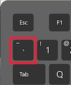

<p align="center">
  <br />
  <a href="https://nodejs.org">
    <picture>
      <source media="(prefers-color-scheme: dark)" srcset="https://nodejs.org/static/images/logos/nodejs-new-pantone-white.svg">
      
    </picture>
  </a>
</p>

<h1 align="center">Help</h1>

Need help with Node.js? You've come to the right place!

## Install

Check out [this wiki](https://github.com/nodejs/help/wiki/Installation)
to learn how to install Node.js via binary archive on Linux and AIX.

## Participate

You can participate by asking or answering open questions present
in the [issues section](https://github.com/nodejs/help/issues).

#### Note

When inserting your code use 3 backticks, followed by `js` as shown below:



````
```js
console.log('happy coding!');
```
````

It gets rendered as such:
```js
console.log('happy coding!');
```

## Chat

If you would prefer to get help via live chat rather than the issue tracker
in this repository, you can try:

* [#nodejs](https://openjs-foundation.slack.com/archives/CK9Q4MB53) channel on the OpenJS Foundation Slack ([join here](https://slack-invite.openjsf.org/))
* [#node.js channel on libera.chat](https://web.libera.chat?channels=node.js&uio=d4)
* [Node.js Slack Community](https://node-js.slack.com/)
  * To register: [nodeslackers.com](https://www.nodeslackers.com/)
